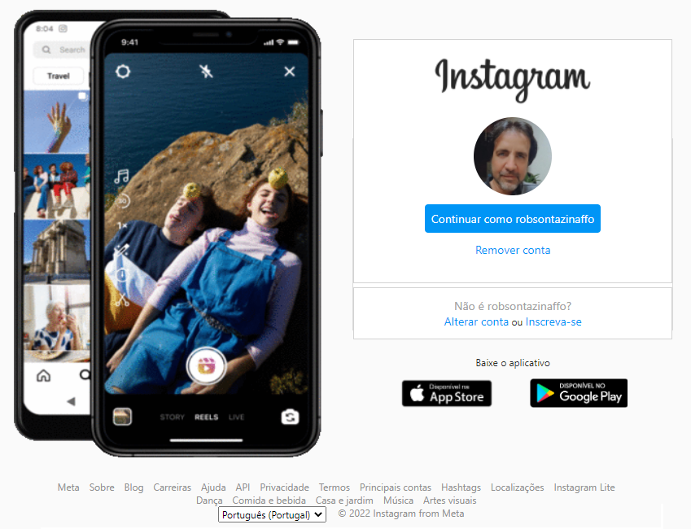

## Descrição do Desafio

Reconstruir a página de login do Instagram, utilizando HTML e CSS e uso de Flexbox, uma das abordagens de posicionamento de elementos mais utilizadas quando se trata de responsividade.

## Links Úteis

- [Repositório no GitHub](https://github.com/SpruceGabriela/instagram-dio) (código original usado como referência)

### Requisitos:

* [HTML básico](https://www.w3schools.com/html/)
* [CSS básico](https://developer.mozilla.org/pt-BR/docs/Web/CSS)

### Minhas contribuições ao código original foram:

1. Ícone no título da página
2. Criei e adicionei um gif animado semelhante ao do instagram no lugar da imagem estática do smartphone.
3. Acrescentei o rodapé semelhante ao do instagram, inclusive com a opção de seleção de idioma.
4. Configurei o CSS para respeitar a responsividade e outros estilos de fontes.

## 👍 Fique a vontade para modificar 👍

